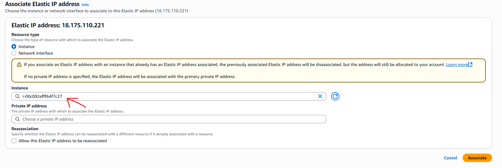

# Networking assignment

## I will explain how to purchase a domain from AWS Route 53 and link it to an EC2 instance running nginx on port 80 at first, then I will go through how to enable HTTPS so that it can be accessed on port 443 which is more secure. I will also explain how you can customise the front end interface.

## I will also explain how you can use an elastic IP rather than the public IP, i will analyse its benefits and drawbacks.

### Step 1: Buy a domain from AWS Route 53:

Go to AWS Route 53 then click register a domain, entrer a domain name and select one that is available, watch out for the price too, then proceed to checkout.

Next go to hosted zone, your domain should be there. Click on your domain and you should be able to see it including the records, we will need to come back here.

### Step 2: Create an EC2 instance:

Navigate to the EC2 service in AWS, go to instancess and click launch instance. Give it a name of your choice and choose an OS, i chose Ubuntu.

Then select an instance type, i decided to go with t2.micro

After that create a new key pair and give it a name of your choice, type-->RSA, private key file format-->.pem

Create the key pair and download the file, put the .pem file into a new directory. Make sure the directory (with the .pem key inside) is located within the ~ (home) directory in linux

Then create a security group and allow SSH from your IP address, allow HTTP and HTTPS traffic from the internet. Now launch the instance

### Step 3: SSH into the EC2 instance:

Once the instance has launched, select the instance and click on connect then go to the SSH tab. On the terminal enter the directory with the pem key with the command: cd (directory_name)

Then run the command chmod 400 "<name_of_pem_file>.pem"

This command sets the file to read-only for the owner, no one else can read, write or execute it

SSH into the EC2 instance with the command:
ssh -i "<name_of_pem_file>.pem" ubuntu@ec2-3-8-96-204.eu-west-2.compute.amazonaws.com

### Static vs dynamic IP address (elastic IP address vs EC2 public IP address):

Firstly we need to grab the IP address of the EC2 instance, to do this we can go to our instance and select it, down below copy the public IPv4 address

Before we link the EC2's public IPv4 address it is cruicial to understand how it works. The public IPv4 address is the IP address that is accessible from the internet which allows you (and anyone else if you allow it from the security rules) to connect to the EC2 instance from outside AWS.

This public IPv4 address is a dynamic address, by default, AWS gives your EC2 instance a dynamic public IP address which means that the public IP address changes everytime you stop and start the instance. if you want a permanent IP address you would have to use an elastic IP. For that reason we will use an elastic IP because it is a static IP address.

If we dont use an elastic IP, everytime we stop and start the instance we would have to link the new public IP address to the domain.

If you wish to use the public IP address then copy it and go to step 5

### Step 4: Create and allocate elastic IP address:

On the AWS side-bar, click on elastic IPs and click allocate elastic IP address and click allocate.

Then select the elastic IP address and click actions, then click on associate elastic IP address and select the EC2 instance we created and launched earlier

Now we have successfully allocated an elastic IP address to our EC2 instance

### Step 5: Creating A record for domain and allocating public IP address/elastic IP address to it

Go to the running EC2 instance and select it, then copy the IP address.

Go to Route 53 and navigate to hosted zone, your domain should be there, click on it.

Click create record, for the name we can create a subdomain or just leave it as root (not enter a subdomain), i will leave it as root. In the value section enter the elastic IP address or the public IP address if you chose not to go with elastic. Make sure you are creating an A record. Then click create record.

### Step 6: Install and run nginx:

Once you have connected to the EC2 instance via SSH, then run these commands into the terminal:

sudo apt update

sudo apt install nginx -y

sudo systemctl start nginx

sudo systemctl enable nginx

To check the status of ngninx you can run the command:

sudo systemctl status nginx

Now we have to edit the nginx server block so nginx knows which domain to serve:

sudo vim /etc/nginx/sites-available/default

Edit the server=_; and replace _ with your A record domain

Now we have to test the nginx config for errors:
sudo nginx -t

If everything is good we can reload the changes with this command:

sudo systemctl reload nginx

To test the website run the command:
curl http://localhost

Or more specifically:
curl -L http://domainname

This command displays the html code of the website

To fetch only the headers we can do:
curl -I http://domainname

If we see HTTP/1.1 200 OK, then the website is running as intended.

We can now enter into the website by entering http://domainename, for my case i would be entering http://hastiamin.co.uk

### Step 7: Enabling HTTPS:

To enable HTTPS we can run the command:

sudo apt install certbot python3-certbot-nginx -y

Now we need to run Certbot for our domain:

sudo certbot --nginx -d yourdomainname

For my case i would run: sudo certbot --nginx -d hastiamin.co.uk

It will prompt you for your email so make sure you enter it.

Now run this command to test if its working via HTTPS:
curl -L https://domainname

You could also just do curl -I https://domainname to get the headers.

You can also enter the domain into the browser and it should load.

### Step 8: customising the HTML/CSS:

Firstly enter and view the /var/www/html directory with this command:

cd /var/www/html

ls

To edit the HTML run this command:

sudo vim index.nginx-debian.html

Then edit the HTML to your desired website style.

If you like you could create a css file and link it to the HTML file and add css but that is beyond the scope of this task.

### Key notes:

Since we used an elastic IP, it is a static IP address meaning that if we close the instance and relaunch it, the IP address of the instance will not change. If we didnt use an elastic IP address, then we would have had to update the A record for the domain and entered the new IP address.
